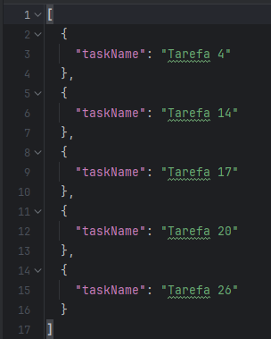
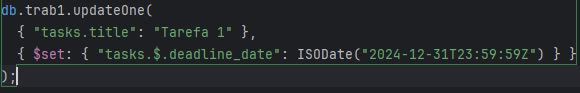

🍃

**Trabalho 01 - MongoDB**

(BD Orientado a Documentos)

**Disciplina: Banco de Dados NoSQL**

**Prof.**: Camilo Barreto

**Período:** 4

**Curso:** Tec. Sistemas para Internet

**IFTM - Campus Uberlândia Centro**

**Informações:**

\- **Data de publicação:** 06/10/2023

\- **Data de entrega**: 20/10/2023

\- **Local de entrega:** Class Room

\- **Formato de entrega:** github (detalhes no final do documento).

\- **Pontos:** 15 pts

Passo 1 -

O arquivo JSON se encontra disponível dentro do repositório do GitHub.

A escolha de cada campo foi feita de acordo com o Modelo do BD que foi passado. Irei repassar as 	informações mais importantes sobre os campos escolhidos.

tasks: Uma lista de tarefas relacionadas a este projeto. Cada tarefa é representada como um documento embutido contendo as informações relacionadas à tarefa.

title (VARCHAR): O título da tarefa.

description (VARCHAR): Uma descrição mais detalhada da tarefa. start\_date (DATE): A data de início da tarefa. Indica quando a tarefa foi iniciada ou está programada para começar.

deadline\_date (DATE): A data limite para a conclusão da tarefa. É a data em que a tarefa deve ser concluída.

priority (INTEGER): Uma classificação feita com números que representa a prioridade da tarefa. 

status (VARCHAR): Indica o estado atual da tarefa, como "Pendente", "Em Progresso" ou "Concluída".

Passo 2 -

Arquivo JSON no GitHub.

Passo 3 -

O Schema de criação é o mesmo para o Passo 2, logo não coloquei ele aqui, irei colocar apenas os outros scripts usados

Passo 4 -

Inserção feita pelo Json disponível no GitHub

Crie 15 queries para busca de projetos, tarefas e usuários;

1 - Todas as tarefas de um projeto que estejam com status “To-Do” (a fazer)

2 - Todas as tarefas de um usuário que estejam com o status “To-Do” (a fazer)

3 - Todas as tarefas com o prazo de entrega vencido.

4 - Todas as tarefas ordenadas por prioridade:

5 - Todas as tarefas concluídas em um projeto específico:

6 - Mostrar todas as tasks dos projetos

7 - Todas as tarefas atribuídas a usuários ordenadas por prioridade

8 -Todas as tarefas que foram concluídas em um determinado período de tempo (por exemplo, de "2023-10-15" a "2023-10-30")

9 - Contar as tarefas que estão em progresso (status "Em Progresso")

10 - Contar Tasks concluidas por todos usuários

11 - Tasks concluidas nos ultimos 7 dias

12 - Tasks com prazo de entrega nos proximos 3 dias

13 - Todas as tarefas concluídas atribuídas a usuários com prioridade 1

14 - Todos os projetos ordenados pelo número de tarefas em progresso (status "Em Progresso")

15 - Todos os usuários que têm pelo menos uma tarefa concluída com prioridade 1

Passo 5 -

1 - Alterar quem será o usuário responsável pela tarefa;

2 - Dilatar o prazo de entrega da tarefa;

3 - Mudar o status de “In Progress” para “Complete”;

Antes:

Depois:

4 - Alterar a prioridade de uma tarefa específica

Antes:

Depois:

5 - Mudar o status de "Pendente" para "Em Progresso" para uma tarefa específica

Antes: 

Depois:

Passo 6 -

Os log’s foram enviados pelo github no formato MarkDown
